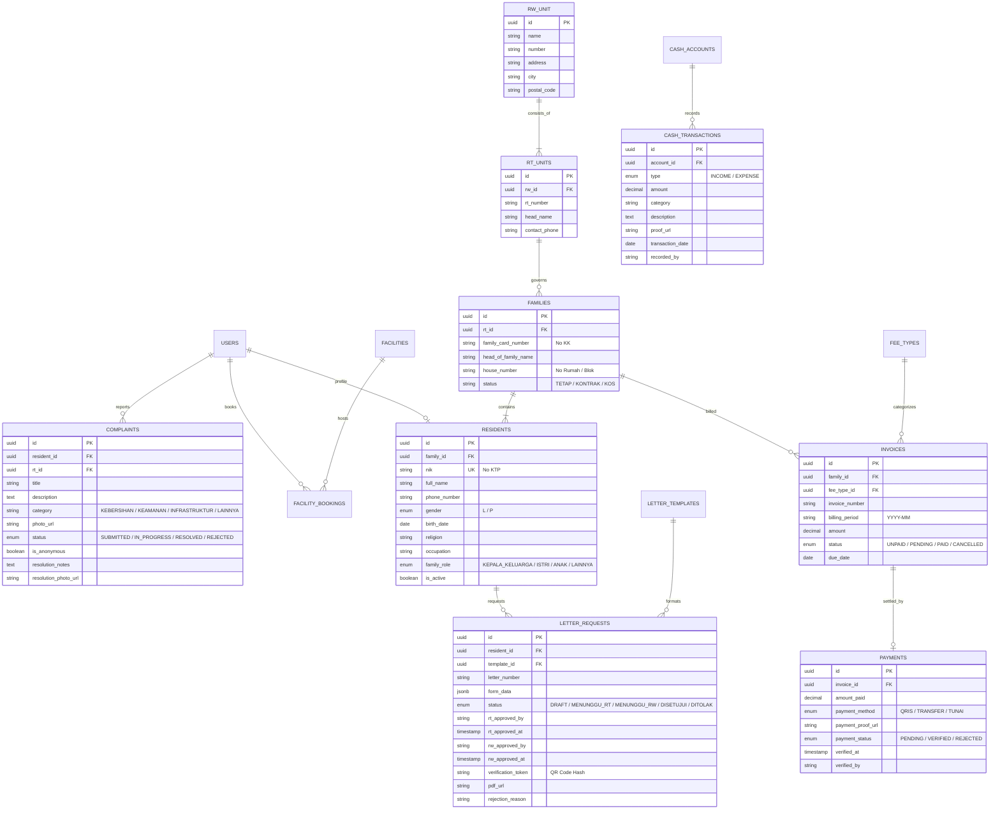
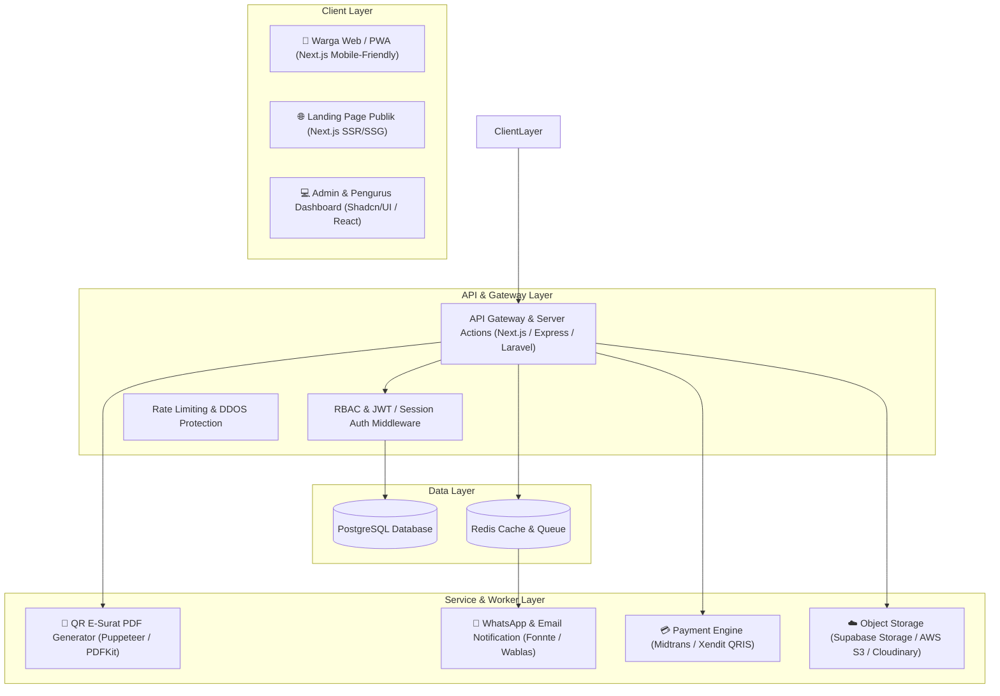
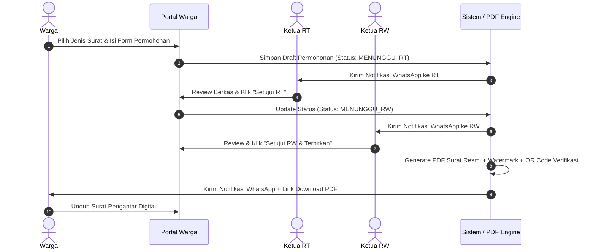
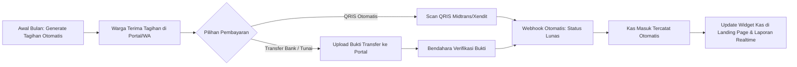
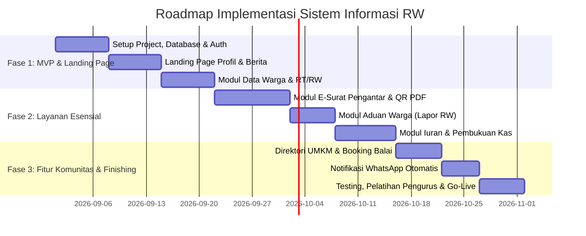

# 📋 PRODUCT REQUIREMENTS DOCUMENT (PRD) & ARSITEKTUR SISTEM
## SISTEM INFORMASI & LAYANAN DIGITAL RUKUN WARGA (RW-DIGITAL)

---

## 1. PENDAHULUAN & LATAR BELAKANG

### 1.1 Masalah Riil di Lingkungan RW & RT
1. **Birokrasi Surat Pengantar Konvensional**: Warga harus mencari Ketua RT secara fisik, menunggu tanda tangan, lalu membawa berkas fisik lagi ke Ketua RW. Sering tertunda jika pengurus sedang bekerja/keluar kota.
2. **Pengelolaan Iuran Warga & Kas yang Rawan Selisih**: Catatan iuran keamanan/kebersihan manual di buku kas sering menimbulkan salah pencatatan, minim transparansi, dan warga sering lupa bayar.
3. **Penyebaran Informasi Tidak Efektif**: Pengumuman penting sering tenggelam di grup WhatsApp warga atau hanya lewat pengeras suara/poster.
4. **Data Kependudukan Tidak Terpusat**: Sulit memetakan warga lansia, balita, warga kontrak/kost vs warga tetap saat penyaluran bansos atau kegiatan posyandu.
5. **Aduan & Aspirasi Lingkungan Tanpa Tracking**: Laporan fasilitas rusak (lampu jalan mati, selokan mampet, sampah liar) sering tidak terpantau tindak lanjutnya.

### 1.2 Tujuan Aplikasi (Goals & Objectives)
- **Bagi Warga**: Kemudahan akses layanan mandiri (surat pengantar online, transparansi iuran, pengaduan lingkungan, info resmi) secara 24/7 dari smartphone.
- **Bagi Pengurus RT/RW**: Efisiensi administrasi, otomasi rekapitulasi keuangan & iuran, validasi surat digital ber-QR Code, serta database kependudukan yang akurat.
- **Bagi Lingkungan**: Transparansi keuangan kas lingkungan untuk meningkatkan kepercayaan (*trust*) warga dan pemberdayaan ekonomi lokal (UMKM warga).

---

## 2. USER PERSONAS & ROLE-BASED ACCESS CONTROL (RBAC)

| Role | Deskripsi & Hak Akses |
| :--- | :--- |
| **Warga (Publik / Login)** | • Melihat landing page publik, profil RW, pengumuman, direktori UMKM. • Login portal warga: Ajukan surat, bayar iuran, kirim aduan, booking balai/fasilitas, cek status pengajuan. |
| **Pengurus RT (Ketua/Sekretaris RT)** | • Dashboard level RT. • Validasi permohonan surat warga di RT-nya. • Manajemen data warga/KK di wilayah RT bersangkutan. • Rekapitulasi iuran tingkat RT. |
| **Pengurus RW (Ketua/Sekretaris RW)** | • Dashboard level RW. • Approval final surat pengantar ber-QR Code. • Manajemen pengumuman, berita, agenda kegiatan RW. • Monitoring laporan aduan seluruh RT. |
| **Bendahara (RT / RW)** | • Manajemen pos iuran bulanan (keamanan, sampah, kas). • Verifikasi pembayaran manual/otomatis. • Pembukuan kas masuk/keluar & generate laporan keuangan real-time. |
| **Petugas Lapangan / Keamanan (Satpam/Seksi Lingkungan)** | • Update status tindak lanjut aduan warga (foto sebelum/sesudah). • Jadwal ronda/siskamling. |
| **Super Admin** | • Konfigurasi sistem, manajemen master data RT/RW, template surat, hak akses akun. |

---

## 3. SPESIFIKASI FITUR SISTEM

### 3.1 Bagian 1: Landing Page Publik (Warga & Umum)
1. **Hero Section & Sambutan**: Banner profil, sambutan Ketua RW, jargon/motto lingkungan.
2. **Statistik Wilayah**: Counter jumlah RT, total KK, total warga, fasilitas umum.
3. **Layanan Cepat (Quick Access)**:
   - Tombol "Ajukan Surat Pengantar"
   - Tombol "Lapor Aduan Warga"
   - Tombol "Cek Tagihan Iuran"
   - Tombol "Kontak Darurat / Panic Number"
4. **Berita, Agenda & Pengumuman**: Berita kegiatan kerja bakti, posyandu, peringatan hari besar, pengumuman penting RW.
5. **Transparansi Kas RW**: Widget ringkasan saldo kas umum RW & grafik pemasukan/pengeluaran bulan berjalan.
6. **Direktori Fasilitas Umum & Booking**: Kalender ketersediaan Balai RW, Lapangan Olahraga, Tenda RW.
7. **Pojok UMKM Warga**: Katalog produk/jasa buatan warga sekitar lengkap dengan kontak WhatsApp penjual.
8. **Struktur Organisasi**: Bagan kepengurusan RW, seksi-seksi, dan daftar Ketua RT 01 s/d RT n.
9. **Kontak Darurat Terpadu**: Tombol cepat telpon Damkar, Polsek, Babinsa, Bhabinkamtibmas, Puskesmas, Pos Satpam RW.

### 3.2 Bagian 2: Portal Mandiri Warga (Mobile Web / PWA)
1. **Autentikasi Aman**: Login dengan No. HP / WhatsApp OTP atau NIK + Password.
2. **E-Surat Pengantar Mandiri**:
   - Pilih jenis surat (Domisili, SKCK, Keterangan Belum Menikah, Keterangan Usaha, Kematian, Pindah Datang, dll).
   - Form dinamis + upload lampiran (KTP / KK / Surat bukti).
   - Tracking progress live (Menunggu RT -> Disetujui RT -> Disetujui RW -> Siap Download).
   - Download file PDF resmi dengan QR Code Verifikasi.
3. **Billing & Iuran Online**:
   - Riwayat tagihan per bulan.
   - Pembayaran via QRIS (otomatis) atau Transfer Manual + Upload Bukti Bayar.
   - Bukti tanda terima digital (e-receipt).
4. **Lapor Warga (Ticketing Aduan)**:
   - Form aduan + kategori (Infrastruktur, Keamanan, Kebersihan, Ketertiban).
   - Upload foto lokasi & koordinat/deskripsi.
   - Mode Privasi: Opsi "Lapor Anonim" (hanya terlihat admin).
   - Timeline pengerjaan aduan.

### 3.3 Bagian 3: Admin Dashboard (Pengurus RT & RW)
1. **Dashboard Utama**:
   - KPI: Total Pengajuan Surat Baru, Total Tagihan Belum Lunas, Aduan Pending, Kas Masuk Bulan Ini.
   - Chart demografi penduduk (berdasarkan usia, pekerjaan, status tinggal tetap/kontrak).
2. **Manajemen Kependudukan**:
   - Data Kartu Keluarga (Nomor KK, Alamat, No Rumah, RT).
   - Data Warga (NIK, Nama, Jenis Kelamin, Tempat/Tgl Lahir, Agama, Hubungan Keluarga, Status Tinggal).
   - Export & Import Excel/CSV format resmi Dukcapil/Desa.
3. **Workflow E-Surat & Template Generator**:
   - Custom template surat (Header RW, Nomor Surat otomatis, Tanda Tangan Digital / QR Code verifikasi keaslian dokumen).
   - Review & Approval berjenjang (RT -> RW).
4. **Manajemen Keuangan & Billing (E-Kas RW/RT)**:
   - Pengaturan tarif iuran bulanan per RT/tipe rumah (misal: Rumah Tinggal vs Ruko).
   - Bulk invoice generation tiap awal bulan.
   - Rekonsiliasi pembayaran & pembukuan kas masuk/keluar multi-pos (Kas Operasional, Kas Sosial, Kas Pembangunan).
   - Laporan PDF/Excel Arus Kas bulanan dan tahunan.
5. **Manajemen Aduan & Penugasan (Helpdesk)**:
   - Menugaskan aduan ke seksi terkait/petugas lapangan.
   - Update progres pengerjaan dan bukti foto penanganan selesai.
6. **CMS Landing Page**:
   - Editor berita / artikel / pengumuman kegiatan.
   - Upload galeri foto & video.
   - Manajemen approval listing UMKM warga.

---

## 4. SKEMA DATABASE (ENTITY RELATIONSHIP SCHEMA)

---

## 5. ARSITEKTUR SISTEM & INTEGRASI

---

## 6. WORKFLOW & FLOWCHART UTAMA

### 6.1 Alur Pengajuan E-Surat Pengantar RW (Dengan Verifikasi QR)

### 6.2 Alur Iuran Warga & Transparansi Kas

---

## 7. REKOMENDASI TECH STACK & ESTIMASI INFRASTRUKTUR

### Opsi Stack Modern & Hemat Biaya (Sangat Direkomendasikan)
- **Frontend & Backend**: **Next.js 14/15 (App Router, TypeScript)**
- **Styling & UI**: **Tailwind CSS + Shadcn/ui + Lucide Icons + Framer Motion**
- **Database & Auth & File Storage**: **Supabase (Managed PostgreSQL, Auth, S3 Storage, Realtime)**
- **PDF Generator**: `@react-pdf/renderer` atau `pdf-lib` (ringan, cepat, hemat memori)
- **WhatsApp Gateway**: Fonnte / Wablas API (Kirim link surat & notif tagihan)
- **Payment Gateway**: Midtrans (Snap/Core API QRIS) atau Xendit
- **Deployment**: Vercel / Railway / VPS Ubuntu (Coolify / Docker)

### Estimasi Biaya Operasional (Cost Estimate)
| Komponen | Provider Rekomendasi | Estimasi Biaya/Bulan |
| :--- | :--- | :--- |
| **Domain Resmi (.id / .org / .com)** | Niagahoster / Rumahweb / Cloudflare | ~Rp 15.000 - Rp 25.000 / bln (Rp 150rb - 250rb / thn) |
| **Hosting & Backend Server** | Vercel (Free/Hobby) + Supabase (Free Tier s/d 500MB DB) | **Rp 0 / bln** (Gratis untuk skala 1 RW) |
| **WhatsApp Notification Gateway** | Fonnte / Wablas | ~Rp 50.000 - Rp 100.000 / bln |
| **Payment Gateway (QRIS)** | Midtrans | 0.7% per transaksi sukses (Hanya saat ada transaksi) |
| **Total Estimasi Biaya Rutin** | | **~Rp 75.000 - Rp 150.000 / bulan** |

---

## 8. ROADMAP PENGEMBANGAN (STEP-BY-STEP IMPLEMENTATION PLAN)

---

## 9. ASPEK KEAMANAN & PRIVASI DATA (UU PDP INDONESIA)
1. **Perlindungan NIK & Data Pribadi**: NIK dan nomor KK wajib dienkripsi atau disamarkan (*masked*, misal `320101******0001`) di tampilan umum.
2. **Validitas Surat Digital**: Setiap surat pengantar memiliki URL verifikasi publik ber-token unik (misal: `https://domain-rw.id/verify/{token}`) yang menampilkan metadata validitas pengurus tanpa membocorkan data sensitif warga.
3. **Role Segregation**: Pengurus RT hanya boleh melihat data warga di RT mereka sendiri; Pengurus RW memiliki visibilitas lintas RT.
4. **Audit Trail**: Pencatatan riwayat (*log activity*) setiap perubahan data kas dan persetujuan surat untuk mencegah penyalahgunaan wewenang.
